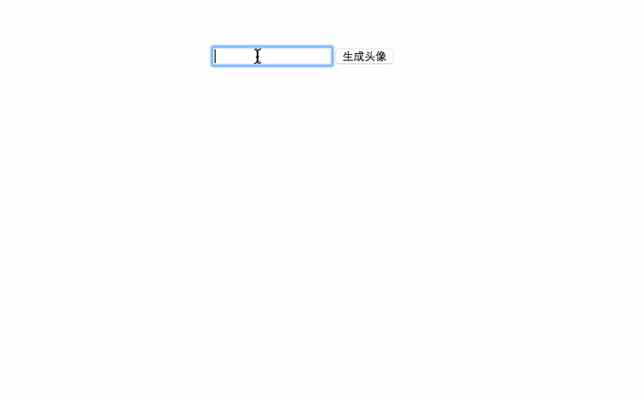

# md5头像生成demo

md5头像常见于人员列表，比如联系人列表。

在用户没有头像时，md5头像是一个比一张默认头像的图片更漂亮的呈现方式。

效果展示：

原理：

* 通过把用户人名(昵称)经过md5加密后的字符串通过一个算法得出一个指定数值，这个数值就是给定的色值数组下标，因此可以取得固定的色值

* 取得色值后，以色值为头像北京，以人名的最后两个字符(中文是最后两个字符，应为为前两个字符)为头像内容，生成md5头像。

原理比较简单，具体的需求可以做响应的修改。
